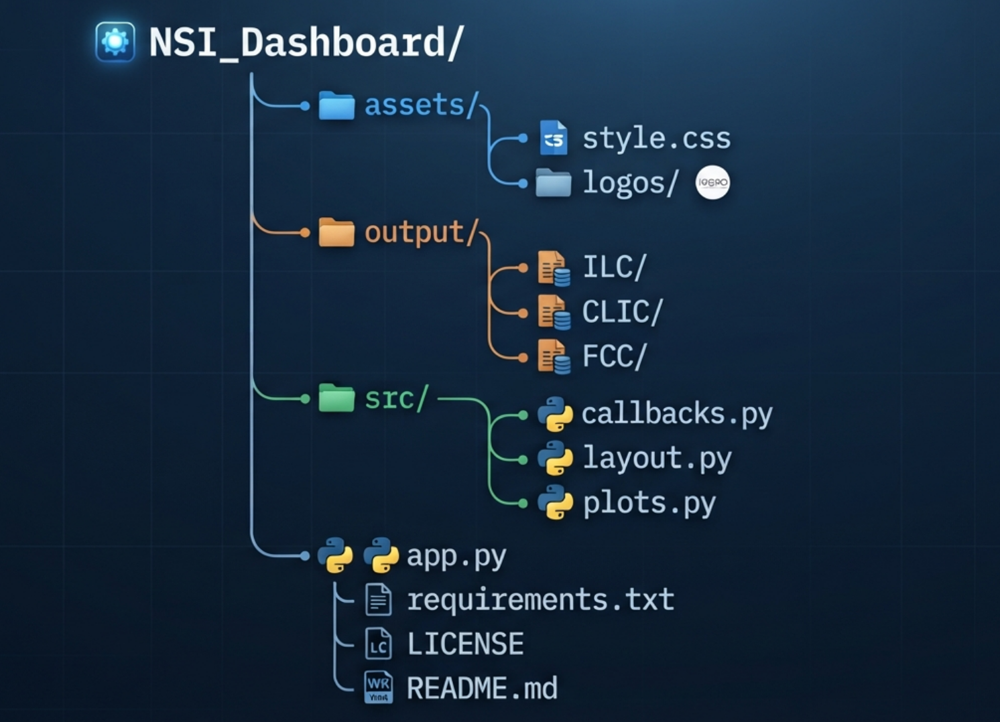

# Neutrino Leptonic NSI Analysis Dashboard

An interactive dashboard for studying the sensitivity of future electron-positron colliders to **Leptonic Non-Standard Neutrino Interactions (NSI)** through the monophoton process

$$
e^-e^+ \rightarrow \gamma + E_T^{\rm miss}.
$$

The dashboard provides interactive visualization of

- Signal and background kinematic distributions
- Cross-section as a function of mediator mass
- NSI sensitivity (3σ limits)
- Collider comparison
- Beam polarization comparison
- Different operating scenarios
- Different mediator widths

The application is written in **Python** using **Dash**, **Plotly**, **Pandas**, and **Uproot**, while the analysis histograms are generated using **ROOT**.

---

## Features

- Interactive histogram viewer
- Interactive cross-section plots
- Interactive NSI sensitivity plots
- Multiple collider support
    - ILC
    - CLIC
    - FCC-ee
- For each collider
    - Beam polarization selection
    - Multiple mediator masses
    - Multiple mediator widths
    - Linear / logarithmic axis switches
    - Operating scenario comparison
    - Comparison of:
        - Pure Signal
        - Signal + Interference
    - Responsive web interface
---

## Repository Structure




---

## Installation

Clone the repository

```bash
git clone https://github.com/<username>/NSI_Dashboard.git
cd NSI_Dashboard
```

Create or activate a Python 3 environment (optional, but recommended), and install the required dependencies.

Required Python packages

- dash
- dash-bootstrap-components
- plotly
- pandas
- numpy
- uproot

Install them individually

```bash
pip install dash
pip install dash-bootstrap-components
pip install plotly
pip install pandas
pip install numpy
pip install uproot
```

or simply install all dependencies using

```bash
pip install -r requirements.txt
```

---

## Running the Dashboard

From the project directory launch the dashboard 

```bash
python app.py
```

The dashboard will be available at
```
http://127.0.0.1:8050
```

To access it from another device on the same network, open

```
http://<your-ip-address>:8050
```

---

## Using the Dashboard

The dashboard consists of four main panels (currently).

### Input Controls

Users can choose

- Collider
- Beam polarization
- Mediator width
- Mediator mass
- Observable

depending on the collider selected.

---

### Histogram

Displays normalized distributions of

- Photon Energy
- Photon Polar Angle

for

- Signal
- Full Signal
- νν Background
- Bhabha Background

The toolbar allows

- Log X
- Log Y
- Grid

---

### Cross Section

Displays

$$
\sigma(e^-e^+\rightarrow\gamma+\nu\bar{\nu})
$$

as a function of mediator mass.

Shows

- Pure signal
- Signal including interference

---

### NSI Sensitivity

Displays the projected

3σ sensitivity for  *$|\epsilon_{\alpha\beta}^{ee}|$*

The user can choose

- Operating scenario
- With / without systematic uncertainties
- Log scale

---

## Data Generation

The dashboard does **NOT** perform event simulation. All input data are generated *externally*. 

The simulation and analysis framework used to generate the dashboard input files is available in the companion repository:

**NSI_SimAna**
*<https://github.com/Saumyenk/NSI_SimAna>*


---

## ROOT Histogram File Structure

The dashboard expects

```
NuNu/
    PhotonE
    CosTheta

Bhabha/
    PhotonE
    CosTheta

Signal/
    M1/
        PhotonE
        CosTheta
...
    M10000/
        PhotonE
        CosTheta

Full/
    M1/
        PhotonE
        CosTheta
...
    M10000/
        PhotonE
        CosTheta
```

---

## Adding New Colliders

To add another collider such as *CEPC*, one can modify the `COLLIDER_INFO` configuration in the prescribed format as other, i.e., mentioning the following properties:
- beam polarizations
- available mediator masses
- operating scenarios
- νν background cross section

and generated output data files for that collider.

No changes are required in the plotting functions.

---

## Deployment

The dashboard is deployed on `Render` which can be accessed at

```
https://dash-nsianalysis.onrender.com/
```

---

## Future Improvements

Planned features include

- Update the summary table
- Export figures as PDF/PNG
- Multi-scenario overlay
- Dark/Light mode toggle
- Automatic axis scaling

---

## Citation

If this dashboard contributes to your research, please cite the associated publication (https://arxiv.org/abs/2507.10703).

---

### Author

**Saumyen Kundu**

Harish-Chandra Research Institute (HRI), Prayagraj

Email: <saumyenkundu@hri.res.in>, <sonny.k.1307@gmail.com>

GitHub: <https://github.com/Saumyenk>

---

### License

This project is distributed under the Apache License 2.0. See the LICENSE file for details.
